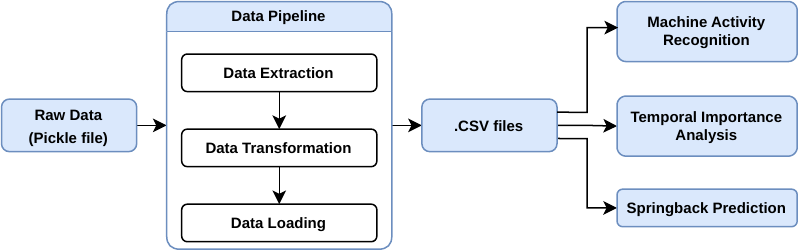
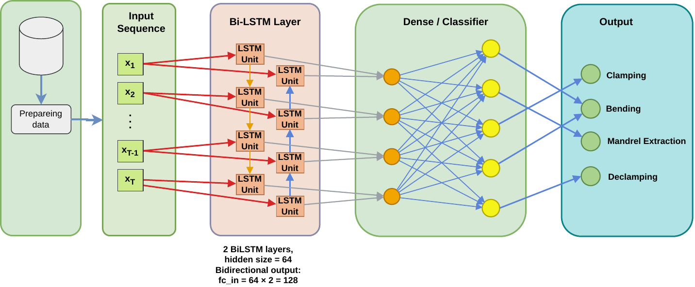
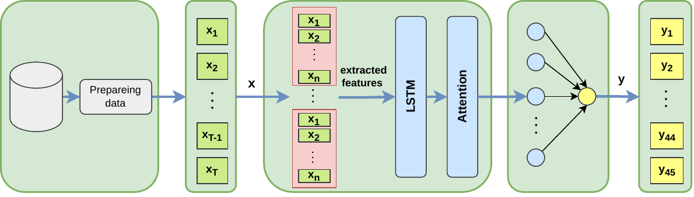
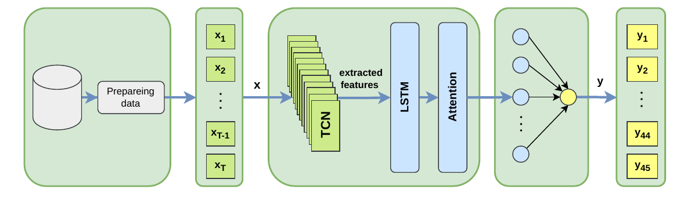
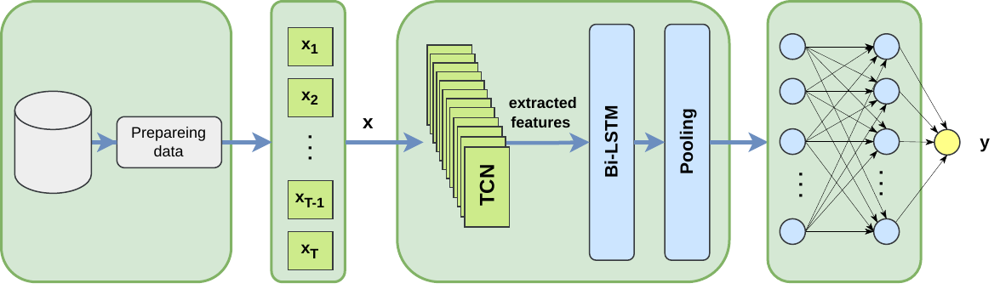

# Machine Learning-Based Detection of Process Phases and Temporal Importance Windows in Rotary Tube Bending

This repository contains a full workflow for my Master's Thesis experiments:

- ETL from the raw experiment pickle into CSV tables
- manual phase annotation with a desktop GUI
- activity recognition for process phases
- train/test split generation for grouped experiments
- temporal pattern analysis/context extraction
- springback prediction
- interactive result inspection in Streamlit

The project is organized around top-level scripts. This README explains what each script does, what it needs before you run it, what it produces, and the recommended execution order.

## Repository Structure



```text
.
|-- 0_data_etl.py
|-- 1_0_annotator.py
|-- 1_1_activity_recognition.py
|-- 2_0_split_data.py
|-- 2_2_0_temporal_pattern_analysis_resmpled.py
|-- 2_2_1_temporal_pattern_analysis_all.py
|-- 3_springback_predictor.py
|-- 4_dashboard_app.py
|-- data/
|-- config/
|-- results/
|-- models/
|-- src/
|-- requirements.txt
```

## Clone

To get started with this project, clone the repository from GitHub:

```bash
git clone https://github.com/arman-niaruhi/temporal-windows-analysis-rotary-tube-bending.git
```

This will download the full project to your local machine. After cloning, navigate into the project directory:

```bash
cd temporal-windows-analysis-rotary-tube-bending
```

## Setup

Run all commands from the repository root.

### Option 1: `venv`

```bash
python -m venv .venv
source .venv/bin/activate
pip install --upgrade pip
pip install -r requirements.txt
```

### Option 2: Conda

```bash
conda create -n tube-geometry python=3.11 -y
conda activate tube-geometry
pip install --upgrade pip
pip install -r requirements.txt
```

If you use the annotator, you need a GUI-capable environment because it uses Qt via `PyQt5`.

## Main Dependencies

The repository depends mainly on:

- `pandas`, `numpy` for data processing
- `matplotlib`, `plotly`, `seaborn` for visualization
- `PyQt5` and `PySide6` for the annotation GUI
- `torch` for sequence models
- `scikit-learn` and `xgboost` for classical ML
- `captum` for interpretability
- `streamlit` for the dashboard

Install everything with `requirements.txt`.

## Data Requirements

### Raw data

The ETL step is the foundation for the rest of the project. If the raw dataset is not available, the downstream scripts cannot run.

The raw source dataset is associated with:

```text
https://github.com/zeyneddinoz/tubebend
```

The raw dataset is provided as a pickle file and must be placed at:

```text
data/raw/experiments_process_and_results.pkl
```

The ETL code reads this file directly from `data/raw`. You can change the path in the source code, but that is usually not recommended.

### Repository-local files already used by later steps

Several later scripts depend on these files:

- `data/ml/machine-and-movement_complete.json`
- `data/ml/unique_bending_setups.csv`

If these files are not already present in your local copy, download them from the project source and place them in `data/ml/`.

### Files generated during this pipeline

Some scripts require outputs created by earlier scripts:

- `data/processed/*.csv` is produced by `0_data_etl.py`
- `config/data-split-config/experiment_setups.csv` is produced by `2_0_split_data.py`
- `config/data-split-config/train_test_split_*.json` is produced by `2_0_split_data.py`

## Recommended Run Order

1. `python 0_data_etl.py`
2. `python 1_0_annotator.py`
3. `python 1_1_activity_recognition.py`
4. `python 2_0_split_data.py`
5. `python 2_2_0_temporal_pattern_analysis_resmpled.py` or `python 2_2_1_temporal_pattern_analysis_all.py`
6. `python 3_springback_predictor.py`
7. `streamlit run 4_dashboard_app.py`

You do not always need to run the full pipeline. Each script below includes its own requirements, so you can execute only the stage you need.
## Script-by-Script Documentation

### `0_data_etl.py`

Purpose:

- runs the preprocessing pipeline
- extracts and transforms the tube-bending dataset
- removes failed experiments
- removes predefined unused columns
- normalizes selected tables
- stores processed CSV files in `data/processed`

What it uses:

- `src.pipeline.preprocessing.data_preprecessor.DataPreprocessPipeline`
- hardcoded ETL settings inside the script:
  - `FAILED_EXPERIMENTS = [1, 48, 166]`
  - `ELIMINATED_COLUMNS`
  - `NORMALIZED_TABLES`
  - `CORRELATION_MATRICES`

Requirements before running:

- the raw experiment dataset must exist and be readable by the extractor code
- Python environment with the packages from `requirements.txt`

Outputs:

- `data/processed/machine_and_movement.csv`
- `data/processed/arc.csv`
- `data/processed/movement.csv`
- correlation outputs generated by the transformer, if enabled

Run:

```bash
python 0_data_etl.py
```

Important note:

- downstream scripts assume `data/processed` already exists

### `1_0_annotator.py`

Purpose:

- opens a PyQt-based annotation tool
- loads processed experiment sensor data
- lets you mark time intervals for:
  - `Clamping`
  - `Bending`
  - `Mandrel Extraction`
  - `De-Clamping`
- saves annotation JSON files
- can also save the current plot as PDF

Requirements before running:

- `data/processed` must already exist
- a GUI-capable machine/session is required
- Qt dependencies installed through `requirements.txt`

This tool can be used either to create new annotations from scratch or to load and edit existing ones. The annotation file used in this study is `data/ml/machine-and-movement_complete.json`, and that file can be reused by the later ML scripts.

What it reads:

- `data/processed/machine_and_movement.csv` via the ETL loader

What it saves:

- annotation JSON chosen by the user in the file dialog
- optional PDF plot chosen by the user in the file dialog

Annotation JSON format:

- grouped by experiment ID
- each experiment contains a list of label intervals with:
  - `label`
  - `start`
  - `end`
  - `duration`

Run:

```bash
python 1_0_annotator.py
```

Recommended output path:

- save the labels as `data/ml/machine-and-movement_complete.json` if you want the later ML scripts to use them without code changes

### `1_1_activity_recognition.py`

Purpose:

- trains BiLSTM-based activity-recognition models for machine phase classification



- generates prediction plots
- generates validation confusion matrices
- runs inference plots for the configured labels

Important built-in settings:

- processed data path: `data/processed`
- annotation path: `data/ml/machine-and-movement_complete.json`
- result path: `results/activity_recognition`
- target label default: `Multiclass`
- process part default: `machine_and_movement`
- if you train a model for a specific label or for the multiclass setup, the outputs are stored under the results directory
- if you set `ENABLE_MODEL_TRAINING = False`, you can skip training and run inference using previously saved artifacts

Requirements before running:

- `data/processed/*.csv` must exist
- `data/ml/machine-and-movement_complete.json` must exist
- training dependencies from `requirements.txt` must be installed

Outputs:

- trained classifier artifacts and evaluation artifacts under `results/activity_recognition`
- plots and confusion matrices generated by the classification utilities

Run:

```bash
python 1_1_activity_recognition.py
```

Change points:

- If needed, edit the constants at the top of the script to change label, process part, training mode, batch size, epochs, or inference labels

### `2_0_split_data.py`

Purpose:

- creates experiment-level train/test split files
- expands grouped experiment definitions into per-experiment setup rows
- normalizes setup metadata when required
- saves split JSON files used by the context-extraction and springback models

What it reads:

- `data/ml/unique_bending_setups.csv`

Requirements before running:

- `data/ml/unique_bending_setups.csv` must exist and contain the required columns:
  - `Experiment_Number`
  - `Collet boost`
  - `Mandrel retraction timing`

What it writes:

- `config/data-split-config/experiment_setups.csv`
- `config/data-split-config/normalization_mappings.json`
- `config/data-split-config/train_test_split_each_setup_80.json`
- `config/data-split-config/train_test_split_randomly.json`
- `config/data-split-config/train_test_split_based_on_column_gp1.json`
- `config/data-split-config/train_test_split_based_on_column_gp2.json`
- `config/data-split-config/train_test_split_based_on_column_gp3.json`
- `config/data-split-config/train_test_split_based_on_column_gp4.json`
- `config/data-split-config/train_test_split_based_on_column_gp5.json`
- `config/data-split-config/train_test_split_based_on_column_gp6.json`
- `config/data-split-config/train_test_split_based_on_column_gp7.json`
- `config/data-split-config/train_test_split_based_on_column_gp8.json`
- `config/data-split-config/train_test_split_based_on_column_gp9.json`

Run:

```bash
python 2_0_split_data.py
```

Important note:

- `config/data-split-config/experiment_setups.csv` is required later by the temporal-pattern-analysis scripts and the springback pipeline

### `2_2_0_temporal_pattern_analysis_resmpled.py`

Purpose:

- trains or evaluates the temporal pattern analysis / context extraction pipeline
- uses resampled sensor sequences
- supports LSTM and TCN-LSTM style models



- stores local result artifacts for predictions, attention, feature importance, and metrics

Default built-in configuration:

- processed data path: `data/processed`
- annotation path: `data/ml/machine-and-movement_complete.json`
- split file: `config/data-split-config/train_test_split_based_on_column_gp1.json`
- process part: `All`
- resampling enabled: `True`
- window count: `400`
- model type: `lstm`

Requirements before running:

- `data/processed/*.csv` must exist
- `data/ml/machine-and-movement_complete.json` must exist
- `config/data-split-config/experiment_setups.csv` must exist
- the selected split JSON must exist
- PyTorch and interpretability dependencies from `requirements.txt` must be installed

Outputs:

- results under `results/temporal_pattern_analysis/<run_name>/`
- saved model under the run directory
- prediction plots, attention plots, feature-importance outputs, integrated gradients, and metrics

Run:

```bash
python 2_2_0_temporal_pattern_analysis_resmpled.py
```

Change points:

- edit `GENERAL_SETTING`, `INPUT_PATH_PARAMS`, `PREPROCESSING_PARAMS`, `TRAINING_PARAMS`, and `OCCLUSION_PARAMS` at the top of the script

### `2_2_1_temporal_pattern_analysis_all.py`

Purpose:

- same overall pipeline as the previous script
- uses full sequences without resampling
- defaults to a `tcn_lstm` configuration



Default built-in configuration:

- processed data path: `data/processed`
- annotation path: `data/ml/machine-and-movement_complete.json`
- split file: `config/data-split-config/train_test_split_based_on_column_gp1.json`
- process part: `All`
- resampling disabled in `main()`
- model type: `tcn_lstm`

Requirements before running:

- `data/processed/*.csv` must exist
- `data/ml/machine-and-movement_complete.json` must exist
- `config/data-split-config/experiment_setups.csv` must exist
- the selected split JSON must exist

Outputs:

- results under `results/temporal_pattern_analysis/<run_name>/`
- saved model and evaluation artifacts for the chosen run

Run:

```bash
python 2_2_1_temporal_pattern_analysis_all.py
```

### `3_springback_predictor.py`

Purpose:

- prepares train/test tensors for springback prediction
- trains a random-forest baseline
- trains a TCN-LSTM springback regressor



- saves metrics and prediction plots

Default built-in configuration:

- processed data path: `data/processed`
- annotation path: `data/ml/machine-and-movement_complete.json`
- split file: `config/data-split-config/train_test_split_each_setup_80.json`
- process part: `All`
- resampling disabled
- selected target feature indices: `[1, 3]`

Requirements before running:

- `data/processed/*.csv` must exist
- `data/ml/machine-and-movement_complete.json` must exist
- `config/data-split-config/experiment_setups.csv` must exist
- `config/data-split-config/train_test_split_each_setup_80.json` must exist, or you must change the script to another split file

Outputs:

- results under `results/springback/random_forest/`
- results under `results/springback/tcn_lstm/`
- saved metrics, prediction comparisons, residual plots, and training history

Run:

```bash
python 3_springback_predictor.py
```

Change points:

- edit `INPUT_PATH_PARAMS`, `PREPROCESSING_PARAMS`, and `LSTM_TRAINING_PARAMS` at the top of the script

### `4_dashboard_app.py`

Purpose:

- launches a Streamlit dashboard
- lets you inspect processed experiment tables and plots
- supports interactive dataset selection for:
  - `arc`
  - `machine_and_movement`
  - `movement`

Requirements before running:

- `data/processed/*.csv` must exist
- `streamlit` and plotting dependencies must be installed

What it reads:

- `data/processed/*.csv`

What it shows:

- interactive Plotly line plots
- raw processed tables for selected experiment IDs

Run:

```bash
streamlit run 4_dashboard_app.py
```

## Output Locations

Main output directories used in this project:

- `data/processed/` for ETL CSV files
- `config/data-split-config/` for split definitions and expanded experiment setups
- `results/activity_recognition/` for activity-recognition outputs
- `results/temporal_pattern_analysis/` for temporal pattern analysis outputs
- `results/springback/` for springback prediction outputs

## Module Overview

The repository logic is implemented mainly inside `src/`. The top-level scripts are entry points, while the modules below contain the reusable pipeline code.

### `src/logging`

Purpose:

- provides shared logging helpers used across the project

Main files:

- `src/logging/logging_config.py`: configures logging format and project-wide logger setup
- `src/logging/log_utils.py`: helper decorators and utility functions for logging function execution

### `src/pipeline/preprocessing`

Purpose:

- contains the ETL pipeline used to transform the raw pickle dataset into structured CSV files

Main files:

- `src/pipeline/preprocessing/extractor.py`: reads the raw pickle file and extracts experiment tables
- `src/pipeline/preprocessing/transformer.py`: cleans, filters, normalizes, and transforms extracted tables
- `src/pipeline/preprocessing/loader.py`: saves and reloads processed CSV tables
- `src/pipeline/preprocessing/data_preprecessor.py`: orchestration layer for the full preprocessing pipeline

Used by:

- `0_data_etl.py`
- `1_0_annotator.py`
- dashboard and ML pipelines that read processed CSV files

### `src/pipeline/dashboard`

Purpose:

- contains helper code for the Streamlit dashboard

Main files:

- `src/pipeline/dashboard/visualizer_utils.py`: loads processed experiment tables and builds Plotly visualizations

Used by:

- `4_dashboard_app.py`

### `src/pipeline/ml/classification/utils`

Purpose:

- contains the activity-recognition pipeline and utilities

Main files:

- `src/pipeline/ml/classification/utils/preprocessing_utils.py`: preprocessing helpers for classification inputs
- `src/pipeline/ml/classification/utils/dataset_utils.py`: dataset preparation and batching utilities
- `src/pipeline/ml/classification/utils/model.py`: model definitions for the classifier
- `src/pipeline/ml/classification/utils/training_utils.py`: training loop and training pipeline entry
- `src/pipeline/ml/classification/utils/inference_one_label.py`: inference helpers and per-label evaluation utilities
- `src/pipeline/ml/classification/utils/plot_utils.py`: prediction and evaluation plotting

Used by:

- `1_1_activity_recognition.py`

### `src/pipeline/ml/context_extractor/utils`

Purpose:

- contains the temporal pattern analysis and context-extraction code
- handles preprocessing, models, training, interpretability, and plotting

Submodules:

- `data/`: dataset loading, normalization, grouping, padding, and resampling
- `models/`: attention LSTM, attention TCN, and hybrid TCN-LSTM models
- `helpers/`: reproducibility, training helpers, and metrics
- `algorithms/`: interpretability and sensitivity methods such as feature importance, integrated gradients, timestep sensitivity, and window occlusion
- `plots/`: training, attention, feature-importance, and prediction plotting helpers
- `training_pipeline_utils.py`: main orchestration function for model training and evaluation
- `target_variance_distribution.py`: target-distribution analysis utilities

Used by:

- `2_2_0_temporal_pattern_analysis_resmpled.py`
- `2_2_1_temporal_pattern_analysis_all.py`
- parts of `3_springback_predictor.py` for shared preprocessing

### `src/pipeline/ml/spring_back_predictior`

Purpose:

- contains the springback prediction training and visualization code

Main files:

- `src/pipeline/ml/spring_back_predictior/training.py`: random-forest baseline and TCN-LSTM training pipeline
- `src/pipeline/ml/spring_back_predictior/plot_utils.py`: springback metrics and comparison plots
- `src/pipeline/ml/spring_back_predictior/plot_lstm.py`: additional plotting helpers for the sequence model

Used by:

- `3_springback_predictor.py`

## Practical Notes

- Run scripts from the repository root because many paths are relative.
- The current activity-recognition entry file in this repository is `1_1_activity_recognition.py`.
- If you create a new annotation file in another location, update the script constants or save the file with the expected name used by the ML scripts.
